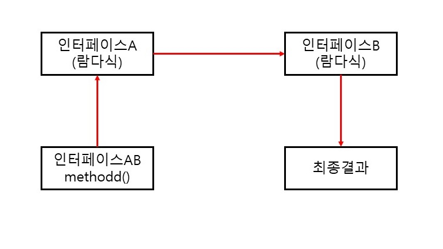
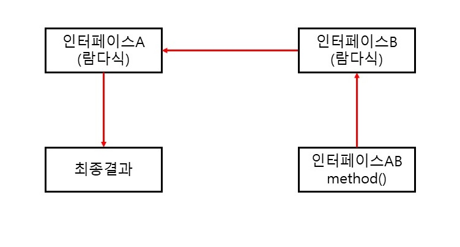

# 람다식

## 람다식이란?

자바는 함수적 프로그래밍을 위해 자바 8부터 람다식(Lambda Expression)을 지원하면서 기존의 코드 패턴이 많이 달라졌다. 람다식은 익명 함수(anonymous function)를 생성하기 위한 식으로 객체 지향 언어보다는 **함수 지향 언어에 가깝다**. 람다식의 형태는 매개 변수를 가진 코드 블록이지만, 런타임 시에는 익명 구현 객체를 생성한다

```
람다식 -> 매개 변수를 가진 코드 블록 -> 익명 구현 객체
```

예를 들어 Runnable 인터페이스의 익명 구현 객체를 생성하는 전형적인 코드는 다음과 같다.

```java
Runnable runnable = new Runnable() { // 익명 구현 객체
    public void run() { ... }
}
```

위 코드에서 익명 구현 객체를 람다식으로 표현하면 다음과 같다.

```java
Runnable runnable = () -> { ... };
```

람다식은 "(매개변수) -> {실행코드}" 형태로 작성되는데, 마치 함수 정의 형태를 띠고 있지만 런타임 시에 인터페이스의 익명 구현 객체로 생성된다. 어떤 인터페이스를 구현할 것인가는 대입되는 인터페이스가 무엇이냐에 달려있다. 위 코드는 Runnable 변수에 대입되므로 람다식은 Runnable의 익명 구현 객체를 생성하게 된다.

## 람다식 기본 문법

함수적 스타일의 람다식을 작성하는 방법은 다음과 같다.

```
(타입 매개변수, ...) -> { 실행문; ... }
```

(타입 매개변수, ...)는 오른쪽 중괄호 {} 블록을 실행하기 위해 필요한 값을 제공하는 역할을 한다. 매개 변수의 이름은 개발자가 자유롭게 줄 수 있다. -> 기호는 매개 변수를 이용해서 중괄호 {}를 실행한다는 뜻으로 해석하면 된다. 예를 들어 int 매개 변수 a의 값을 콘솔에 출력하기 위해 다음과 같이 람다식을 작성할 수 있다.

```java
(int a) -> { System.out.println(a); }
```

매개 변수 타입은 런타임 시에 대입되는 값에 따라 자동으로 인식될 수 있기 때문에 람다식에서는 매개 변수의 타입을 일반적으로 언급하지 않는다. 그래서 위 코드는 다음과 같이 작성할 수 있다.

```java
(a) -> { System.out.println(a); }
```

만약 매개 변수가 없다면 람다식에서 매개 변수 자리가 없어지므로 다음과 같이 빈 괄호()를 반드시 사용해야 한다.

```
() -> { 실행문; ... }
```

중괄호 {}를 실행하고 결과값을 리턴해야 한다면 다음과 같이 return문으로 결과값을 지정할 수 있다.

```java
(x, y) -> { return x + y; };
```

중괄호 {}에 return문만 있을 경우, 람다식에서는 return문을 사용하지 않고 다음과 같이 작성하는 것이 정석이다.

```
(x, y) -> x + y
```

## 타겟 타입과 함수적 인터페이스

람다식의 형태는 매개 변수를 가진 코드 블록이기 때문에 마치 자바의 메소드를 선언하는 것처럼 보여진다. 자바는 메소드를 단독으로 선언할 수 없고 항상 클래스의 구성 멤버로 선언하기 때문에 람다식은 단순히 메소드를 선언하는 것이 아니라 이 메소드를 가지고 있는 객체를 생성해 낸다.

```
인터페이스 변수 = 람다식;
```

람다식은 인터페이스 변수에 대입된다. 이 말은 **람다식은 인터페이스의 익명 구현 객체를 생성한다는 뜻**이 된다. 인터페이스는 직접 객체화할 수 없기 때문에 구현 클래스가 필요한데, 람다식은 익명 구현 클래스를 생성하고 객체화한다. 람다식은 대입될 인터페이스의 종류에 따라 작성 방법이 달라지기 때문에 람다식이 대입될 인터페이스를 람다식의 타겟 타입(target type)이라고 한다.

- ### 함수적 인터페이스(@FunctionalInterface)

  모든 인터페이스를 람다식의 타겟 타입으로 사용할 수 없다. 람다식이 하나의 메소드를 정의하기 때문에 두 개 이상의 추상 메소드가 선언된 인터페이스는 람다식을 이용해서 구현 객체를 생성할 수 없다. **하나의 추상 메소드가 선언된 인터페이스만이 람다식의 타겟 타입이 될 수 있는데**, 이러한 인터페이스를 함수적 인터페이스(functional interface)라고 한다. 함수적 인터페이스를 작성할 때 두 개 이상의 추상 메소드가 선언되지 않도록 컴파일러가 체킹해주는 기능이 있는데, 인터페이스 선언 시 **@FunctionalInterface** 어노테이션을 붙이면 된다. 이 어노테이션은 **두 개 이상의 추상 메소드가 선언되면 컴파일 오류를 발생**시킨다.

  ```java
  @FunctionalInterface
  public interface MyFunctionalInterface {
      public void method();
      public void otherMethod(); // 컴파일 오류
  }
  ```

  @FunctionalInterface 어노테이션은 선택사항이다. 이 어노테이션이 없더라도 하나의 추상 메소드만 있다면 모두 함수적 인터페이스이다. 그러나 실수로 두 개 이상의 추상 메소드를 선언하는 것을 방지하고 싶다면 붙여주는 것이 좋다.

- ### 매개 변수와 리턴값이 없는 람다식

  ##### MyFunctionalInterface 인터페이스

  ```java
  @FunctionalInterface
  public interface MyFunctionalInterface {
      public void method();
  }
  ```

  이 인터페이스를 타겟 타입으로 갖는 람다식은 다음과 같은 형태로 작성해야 한다. 람다식에서 매개 변수가 없는 이유는 method()가 매개 변수를 가지지 않기 때문이다.

  ```java
  MyFunctionalInterface fi = () -> { ... }
  ```

  람다식이 대입된 인터페이스의 참조 변수는 다음과 같이 method()를 호출할 수 있다. method() 호출은 람다식의 중괄호 {}를 실행시킨다.

  ```java
  fi.method();
  ```

  ##### MyFunctionalInterfaceExample 클래스

  ```java
  public class MyFunctionalInterfaceExample {
      public static void main(String[] args) {
          MyFunctionalInterface fi;
          
          fi = () -> {
              String str = "method call1";
              System.out.println(str);
          };
          fi.method(); // method call1
          
          fi = () -> {
              System.out.println("method call2");
          };
          fi.method(); // method call2
          
          fi = () -> System.out.println("method call3"); // 실행문이 하나라면 중괄호 {}는 생략 가능
          fi.method(); // method call3
      }
  }
  ```

- ### 매개 변수가 있는 람다식

  다음과 같이 매개 변수가 있고 리턴값이 없는 추상 메소드를 가진 함수적 인터페이스가 있다고 하자.

  ##### MyFunctionalInterface 인터페이스

  ```java
  @FunctionalInterface
  public interface MyFunctionalInterface {
      public void method(int x);
  }
  ```

  이 인터페이스를 타겟 타입으로 갖는 람다식은 다음과 같은 형태로 작성해야 한다. 람다식에서 매개 변수가 한 개인 이유는 method()가 매개 변수를 하나만 가지기 때문이다.

  ```java
  MyFunctionalInterface fi = (x) -> { ... } 또는 x -> { ... }
  ```

  람다식이 대입된 인터페이스 참조 변수는 다음과 같이 method()를 호출할 수 있다. 매개값으로 5를 주면 람다식의 x 변수에 5가 대입되고 x는 중괄호 {}에서 사용된다.

  ```java
  fi.method(5);
  ```

  ##### MyFunctionalInterfaceExample 클래스

  ```java
  public class MyFunctionalInterfaceExample {
      public static void main(String[] args) {
          MyFunctionalInterface fi;
          
          fi = (x) -> {
              int result = x * 5;
              System.out.println(result);
          };
          fi.method(2); // 10
          
          fi = (x) -> { System.out.println(x*5); };
          fi.method(2); // 10
          
          fi = x -> System.out.println(x*5);
          fi.method(2); // 10
      }
  }
  ```

- ### 리턴값이 있는 람다식

  다음과 같이 매개 변수가 있고 리턴값이 있는 추상 메소드를 가진 함수적 인터페이스가 있다고 하자.

  ##### MyFunctionInterface 인터페이스

  ```java
  @FunctionalInterface
  public interface MyFunctionalInterface {
      public int method(int x, int y);
  }
  ```

  이 인터페이스를 타겟 타입으로 갖는 람다식은 다음과 같은 형태로 작성해야 한다. 람다식에서 매개 변수가 두개인 이유는 method()가 매개를 변수 두 개 가지기 때문이다. 그리고 method()가 리턴 타입이 있기 때문에 중괄호 {} 에는 return문이 있어야 한다.

  ```
  MyFunctionalInterface fi = (x, y) -> { ...; return 값; }
  ```

  만약 중괄호 {}에 return문만 있고, return 문 뒤에 연산식이나 메소드 호출이 오는 경우라면 다음과 같이 작성할 수 있다.

  ```java
  MyFunctionalInterface fi = (x, y) -> { return x + y; }
  
  MyFunctionalInterface fi = (x, y) -> x + y;
  ```

  ```
  MyFunctionalInterface fi = (x, y) -> {return sum(x, y); }
  
  MyFunctionalInterface fi = (x, y) -> sum(x, y);
  ```

  람다식이 대입된 인터페이스 참조 변수는 다음과 같이 method()를 호출할 수 있다. 매개값으로 2와 5를 주면 람다식의 x 변수에 2, y 변수에 5가 대입되고 x와 y는 중괄호 {}에서 사용된다.

  ```java
  int result = fi.method(2, 5);
  ```

  ##### MyFunctionalInterfaceExample 클래스

  ```java
  public class MyFunctionalInterfaceExample {
      public static void main(String[] args) {
          MyFunctionalInterface fi;
          
          fi = (x, y) -> {
              int result = x + y;
              return result;
          };
          System.out.println(fi.method(2, 5)); // 7
          
          fi = (x, y) -> { return x + y; };
          
          System.out.println(fi.method(2, 5)); // 7
          
          fi = (x, y) -> x + y; // return문만 있을 경우 중괄호 {}와 return문 생략 가능
          Sysetm.out.println(fi.method(2, 5)); // 7
          
          fi = (x, y) -> sum(x, y); // return문만 있을 경우 중괄호 {}와 return문 생략 가능
          System.out.println(fi.method(2, 5)); // 7
      }
      
      public static int sum(int x, int y) {
          return (x + y);
      }
  }
  ```

## 클래스 멤버와 로컬 변수 사용

람다식의 실행 블록에는 클래스 멤버(필드와 메소드) 및 로컬 변수를 사용할 수 있다. 클래스의 멤버는 제약 사항 없이 사용 가능하지만, 로컬 변수는 제약 사항이 따른다.

- ### 클래스의 멤버 사용

  람다식 실행 블록에는 클래스의 멤버인 필드와 메소드를 제약 사항 없이 사용할 수 있다. 하지만 this 키워드를 사용할 때에는 주의가 필요하다. 일반적으로 익명 객체 내부에서 this는 익명 객체의 참조이지만, 람다식에서 this는 내부적으로 생성되는 익명 객체의 참조가 아니라 람다식을 실행한 객체의 참조이다.

  ##### MyFunctionalInterface 인터페이스

  ```java
  public interface MyFunctionalInterface {
      public void method();
  }
  ```

  ##### UsingThis 클래스

  ```java
  public class UsingThis {
      public int outterField = 10;
      
      class Inner {
          int innerField = 20;
          
          void method() {
              // 람다식
              MyFunctionalInterface fi () -> {
                  System.out.println("outterField: " + outterField);
                  Sysetm.out.pritnln("outterField: " + UsingThis.this.outterField + "\n"); // 바깥 객체의 참조를 얻기 위해서는 클래스명.this를 사용
                  System.out.println("innerField: " + innerField);
                  System.out.println("innerField: " + this.innerField + "\n"); // 람다식 내부에서 this는 Inner 객체를 참조
              };
              fi.method;
          }
      }
  }
  ```

  ##### UsingThisExample 클래스

  ```java
  public class UsingThisExample {
      public static void main(String... args) {
          UsingThis usingThis = new UsingThis;
          UsingThis.Inner inner = usingThis.new Inner();
          inner.method();
      }
  }
  ```

- ### 로컬 변수 사용

  람다식은 메소드 내부에서 주로 작성되기 때문에 로컬 익명 구현 개게를 생성시킨다고 봐야 한다. 람다식에서 바깥 클래스의 필드나 메소드는 제한 없이 사용할 수 있으나, 메소드의 매개 변수 또는 로컬 변수를 사용하면 이 두 변수는 final 특성을 가져야 한다. 따라서 매개 변수 또는 로컬 변수를 람다식에서 읽는 것은 허용되지만, 람다식 내부 또는 외부에서 변경할 수 없다.

  ##### MyFunctionalInterface 인터페이스

  ```java
  public interface MyFunctionalInterface {
      public void method();
  }
  ```

  ##### UsingLocalVariable 클래스

  ```java
  public class UsingLocalVariable {
      void method(int arg) { // args는 final 특성을 가짐
          itn localVar = 40; // localVar는 final 특성을 가짐
          
          //arg = 31; // final 특성 때문에 수정 불가
          //localvVar = 41; // final 특성 때문에 수정 불가
  		
          // 람다식
          MyFunctionalInterFace fi = () -> {
              // 로컬 변수 읽기
              System.out.println("arg : " + arg);
              SYstem.out.println("localVar : " + "\n");
          };
          fi.method();
      }
  }
  ```

  ##### UsingLocalVariableExample 클래스

  ```java
  public class UsingLocalVariableExample {
  	public static void main(String... args) {
          UsingLocalVariable ulv = new UsingLocalVariable();
          ulv.method(20);
      }
  }
  ```

## 표준 API의 함수적 인터페이스

자바에서 제공되는 표준 API에서 한 개의 추상 메소드를 가지는 인터페이스들은 모두 람다식을 이용해서 익명 구현 객체로 표현이 가능하다. 예를 들어 스레드 작업을 정의하는 Runnable 인터페이스는 매개 변수와 리턴값이 없는 run() 메소드만 존재하기 때문에 다음과 같이 람다식을 이용해서 Runnable 인스턴스를 생성시킬 수 있다.

##### RunnableExample 클래스

```java
public class RunnableExample {
    public static void main(String[] args) {
        Runnable runnable = () -> { // 람다식(스레드가 실행하는 코드)
            for(int i=0; i<10; i++) {
                System.out.println(i);
            }
        };
        
        Thread thread = new Thread(runnable);
        thread.start();
    }
}
```

Thread 생성자를 호출할 때 다음과 같이 람다식을 매개값으로 대입해도 된다.

```java
Thread thread = new Thread(() -> {
    for(int i=0; i<10; i++) {
        System.out.println(i);
    }
});
```

자바 8부터는 빈번하게 사용되는 함수적 인터페이스(functional interface)는 java.util.function 표준 API 패키지로 제공한다. 이 패키지에서 제공하는 함수적 인터페이스의 목적은 메소드 또는 생성자의 매개 타입으로 사용되어 람다식을 대입할 수 있도록 하기 위해서이다. 자바 8부터 추가되거나 변경된 API에서 이 함수적 인터페이스들을 매개 타입으로 많이 사용한다.

java.util.function 패키지의 함수적 인터페이스는 크게 Consumer, Supplier, Function, Operator, Predicate로 구분된다. 구분 기준은 인터페이스에 선언된 추상 메소드의 매개값과 리턴값의 유무이다.

| 종류      | 추상 메소드 특징                                             |
| --------- | ------------------------------------------------------------ |
| Consumer  | 매개값은 있고, 리턴값은 없음                                 |
| Supplier  | 매개값은 없고, 리턴값은 있음                                 |
| Function  | 매개값도 있고, 리턴값도 있음<br />주로 매개값을 리턴값으로 매핑(타입 변환) |
| Operator  | 매개값도 있고, 리턴값도 있음<br />주로 매개값을 연산하고 결과를 리턴 |
| Predicate | 매개값은 있고, 리턴 타입은 boolean<br />매개값을 조사해서 true/false를 리턴 |

- ### Consumer 함수적 인터페이스

  Consumer 함수적 인터페이스의 특징은 **리턴값이 없는** accept() 메소드를 가지고 있다. accept() 메소드는 단지 매개값을 소비하는 역할만 한다. 여기서 **소비한다는 말은 사용만 할 뿐 리턴값이 없다는 뜻**이다.

  매개 변수와 타입과 수에 따라서 아래와 같은 Consumer들이 있다.

| 인터페이스명          | 추상 메소드                    | 설명                           |
| --------------------- | ------------------------------ | ------------------------------ |
| Consumer\<T>          | void accept(T t)               | 객체 T를 받아 소비             |
| BiConsumer\<T, U>     | void accept(T t, U u)          | 객체 T와 U를 받아 소비         |
| DoubleConsumer        | void accept(double value)      | double 값을 받아 소비          |
| IntConsumer           | void accept(int value)         | int 값을 받아 소비             |
| LongConsumer          | void accept(long value)        | long 값을 받아 소비            |
| ObjDoubleConsumer\<T> | void accept(T t, double value) | 객체 T와 double 값을 받아 소비 |
| ObjIntConsumer\<T>    | void accept(T t, int value)    | 객체 T와 int 값을 받아 소비    |
| ObjLongConsumer\<T>   | void accept(T t, long value)   | 객체 T와 long 값을 받아 소비   |

Consumer\<T> 인터페이스를 타겟 타입으로 하는 람다식은 다음과 같이 작성할 수 있다. accept() 메소드는 매개값으로 T 객체를 하나 가지므로 람다식도 한 개의 매개 변수를 사용한다. 타입 파라미터 T에 String이 대입되었기 때문에 람다식 t 매개 변수 타입은 String이 된다.

```java
Consumer<String> consumer = t -> { t를 소비하는 실행문; }
```

BiConsumer<T, U> 인터페이스를 타겟 타입으로 하는 람다식은 다음과 같이 작성할 수 있다. accept() 메소드는 매개값으로 T와 U 두 개의 객체를 가지므로 람다식도 두 개의 매개 변수를 사용한다. 타입 파라미터 T와 U에 String이 대입되었기 때문에 람다식 t와 u 매개 변수 타입은 각각 String이 된다.

```java
BiConsumer<String, String> consumer = (t, u) -> { t와 u를 소비하는 실행문; }
```

DoubleConsumer 인터페이스를 타겟 타입으로 하는 람다식은 다음과 같이 작성할 수 있다. accept() 메소드는 매개값으로 double 하나를 가지므로 람다식도 한 개의 매개 변수를 사용한다. d는 고정적으로 double 타입이 된다.

```java
DoubleConsumer consumer = d -> { d를 소비하는 실행문; }
```

ObjIntConsumer\<T> 인터페이스를 타겟 타입으로 하는 람다식은 다음과 같이 작성할 수 있다. accept() 메소드는 매개값으로 T 객체와 int 값 두 개를 가지기 때문에 람다식도 두 개의 매개 변수를 사용한다. T가 String 타입이므로 람다식 t 매개 변수 타입은 String이 되고, i는 고정적으로 int 타입이 된다.

```java
ObjIntConsumer<String> Consumer = (t, i) -> { t와 i를 소비하는 실행문; }
```

##### ConsumerExample 클래스

```java
import java.util.function.*;

public class ConsumerExample {
    public static void main(String[] args) {
        Consumer<String> consumer = t -> System.out.println(t + "8");
        consumer.accept("java"); // java8
        
        BiConsumer<String, String> bigConsumer = (t, u) -> System.out.println(t + u);
        bigConsumer.accept("Java", "8"); // Java8
        
        DoubleConsumer doubleConsumer = d -> System.out.println("Java" + d);
        doubleConsumer.accept("8.0"); // Java8.0
        
        ObjIntConsumer<String> objIntConsumer = (t, i) -> System.out.println(t + i);
        objIntConsumer.accept("Java", 8); // Java8
    }
}
```

- ### Supplier 함수적 인터페이스

  Supplier 함수적 인터페이스의 특징은 매개 변수가 없고 리턴값이 있는 getXXX() 메소드를 가지고 있다. 이 메소드들은 실행 후 호출한 곳으로 데이터 리턴(공급)하는 역할을 한다.

  리턴 타입에 따라서 아래와 같은 Supplier 함수적 인터페이스들이 있다.

| 인터페이스명    | 추상 메소드            | 설명              |
| --------------- | ---------------------- | ----------------- |
| Supplier\<T>    | T get()                | T 객체를 리턴     |
| BooleanSupplier | boolean getAsBoolean() | boolean 값을 리턴 |
| DoubleSupplier  | double getAsDouble()   | double 값을 리턴  |
| IntSupplier     | int getAsInt()         | int 값을 리턴     |
| LongSupplier    | long getAsLong()       | long 값을 리턴    |

Supplier\<T> 인터페이스를 타겟 타입으로 하는 람다식은 다음과 같이 작성할 수 있다. get() 메소드가 매개값을 가지지 않으므로 람다식도 ()를 사용한다. 람다식은 중괄호 {}는 반드시 한 개의 T 객체를 리턴하도록 해야 한다. T가 String 타입이므로 람다식의 중괄호는 {} 문자열을 리턴하도록 해야 한다.

```java
Supplier<String> supplier = () -> { ...; return "문자열"; }
```

IntSupplier 인터페이스를 타겟 타입으로 하는 람다식은 다음과 같이 작성할 수 있다. getAsInt() 메소드가 매개값을 가지지 않으므로 람다식 ()를 사용한다. 람다식 중괄호 {}는 반드시 int 값을 리턴하도록 해야 한다.

```java
IntSupplier supplier = () -> { ...; return int값; }
```

- ### Function 함수적 인터페이스

  Function 함수적 인터페이스의 특징은 매개값과 리턴값이 있는 applyXXX() 메소드를 가지고 있다. 이 메소드들은 매개값을 리턴값으로 매핑(타입 변환)하는 역할을 한다.

  매개 변수 타입과 리턴 타입에 따라서 아래와 같은 Function 함수적 인터페이스들이 있다.

  | 인터페이스명              | 추상 메소드                      | 설명                       |
  | ------------------------- | -------------------------------- | -------------------------- |
  | Function\<T, R>           | R apply(T t)                     | 객체 T를 객체 R로 매핑     |
  | BiFunction\<T, U, R>      | R apply(T t, U u)                | 객체 T와 U를 객체 R로 매핑 |
  | DoubleFunction\<R>        | R apply(double value)            | double 객체 R로 매핑       |
  | IntFunction\<R>           | R apply(int value)               | int를 객체 R로 매핑        |
  | IntToDoubleFunction       | double applyAsDouble(int value)  | int를 double로 매핑        |
  | IntToLongFunction         | long applyAsLong(int value)      | int를 long으로 매핑        |
  | LongToDoubleFunction      | double applyAsDouble(long value) | long을 double로 매핑       |
  | LongToIntFunction         | int applyAsInt(long value)       | long을 int로 매핑          |
  | ToDoubleBiFunction\<T, U> | double applyAsDouble(T t, U u)   | 객체 T와 U를 double로 매핑 |
  | ToDoubleFunction\<T>      | double applyAsDouble(T t)        | 객체 T를 double로 매핑     |
  | ToIntBiFunction\<T, U>    | int applyAsInt(T t, U u)         | 객체 T와 U를 int로 매핑    |
  | ToIntFunction\<T>         | int applyAsInt(T t)              | 객체 T를 int로 매핑        |
  | ToLongBiFunction\<T, U>   | long applyAsLong(T t, U u)       | 객체 T와 U를 long으로 매핑 |
  | ToLongFunction\<T>        | long applyAsLong(T t)            | 객체 T를 long으로 매핑     |

  Function\<T, R> 인터페이스를 타겟 타입으로 하는 람다식은 다음과 같이 작성할 수 있다. apply() 메소드는 매개값으로 T 객체 하나를 가지므로 람다식도 한 개의 매개 변수를 사용한다. 그리고 apply() 메소드의 리턴 타입이 R 이므로 람다식 {}의 리턴값은 R 객체가 된다. T는 Student 타입이고 R이 String 타입이므로 t 매개 변수 타입은 Student가 되고, 람다식 중괄호 {}는 String을 리턴해야 한다.

  ```java
  Function<Student, String> function = t -> { return t.getName(); }
  또는
  Function<Student, String> function = t -> t.getName();
  ```

  ToIntFunction\<T> 인터페이스를 타겟 타입으로 하는 람다식은 다음과 같이 작성할 수 있다. applyAsInt() 메소드는 매개값으로 T 객체 하나를 가지므로 람다식도 한 개의 매개 변수를 사용한다. 그리고 applyAsInt() 메소드의 리턴 타입이 int이므로 람다식 중괄호 {}의 리턴값은 int가 된다. T가 Student 타입이므로 t 매개 변수 타입은 Student가 된다.

  ```java
  TointFunction<Student> function = t -> { return t.getScore(); }
  또는
  ToIntFunction<Student> function = t -> t.getScore();
  ```

- ### Operator 함수적 인터페이스

  Operator 함수적 인터페이스는 Function과 동일하게 매개 변수와 리턴값이 있는 applyXXX() 메소드를 가지고 있다. 하지만 이 메소드들은 매개값을 리턴값으로 매핑(타입 변환)하는 역할보다는 매개 값을 이용해서 연산을 수행한 후 동일한 타입으로 리턴값을 제공하는 역할을 한다.

  매개 변수의 타입과 수에 따라서 아래와 같은 Operator 함수적 인터페이스들이 있다.

  | 인터페이스명         | 추상 메소드                          | 설명                   |
  | -------------------- | ------------------------------------ | ---------------------- |
  | BinaryOperator\<T>   | T apply(T, T)                        | T와 T를 연산한 후 리턴 |
  | UnaryOperator\<T>    | T apply(T)                           | T를 연산한 후 T 리턴   |
  | DoubleBinaryOperator | double applyAsDouble(double, double) | 두 개의 double 연산    |
  | DoubleUnaryOperator  | double applyAsDouble(double)         | 한 개의 double 연산    |
  | IntBinaryOperator    | int applyAsInt(int, int)             | 두 개의 int 연산       |
  | IntUnaryOperator     | int applyAsInt(int)                  | 한 개의 int 연산       |
  | LongBinaryOperator   | long applyAsLong(long, long)         | 두 개의 long 연산      |
  | LongUnaryOperator    | long applyAsLong(long)               | 한 개의 long 연산      |

  IntBinaryOperator 인터페이스를 타겟 타입으로 하는 람다식은 다음과 같이 작성할 수 있다. applyAsInt() 메소드는 매개값으로 두 개의 int를 가지므로 람다식도 두 개의 int 매개 변수 a와 b를 사용한다.

  ```java
  IntBinaryOperator operator = (a, b) -> { ...; return int값; }
  ```

- ### Predicate 함수적 인터페이스

  Predicate 함수적 인터페이스는 매개 변수와 boolean 리턴값이 있는 testXXX() 메소드를 가지고 있다. 이 메소드들은 매개값을 조사해서 true 또는 false를 리턴하는 역할을 한다.

  매개 변수 타입과 수에 따라서 아래와 같은 Predicate 함수적 인터페이스들이 있다.

  | 인터페이스명       | 추상 메소드                | 설명                   |
  | ------------------ | -------------------------- | ---------------------- |
  | Predicate\<T>      | boolean test(T t)          | 객체 T를 조사          |
  | BiPredicate\<T, U> | boolean test(T t, U u)     | 객체 T와 U를 비교 조사 |
  | DoublePredicate    | boolean test(double value) | double 값을 조사       |
  | IntPredicate       | boolean test(int value)    | int 값을 조사          |
  | LongPredicate      | boolean test(long value)   | long 값을 조사         |

  Predicate\<T> 인터페이스를 타겟 타입으로 하는 람다식은 다음과 같이 작성할 수 있다. test() 메소드는 매개값으로 T 객체 하나를 가지므로 람다식도 한 갱의 매개 변수를 사용한다.그리고 test() 메소드의 리턴 타입이 boolean이므로 람다식 중괄호 {}의 리턴값은 boolean이 된다. T가 Student 타입이므로 t 매개 변수 타입은 Student가 된다.

  ```java
  Predicate<Student> predicate = t -> { return t.getSex().equals("남자"); }
  또는
  Predicate<Student> predicate = t -> t.getSex().equals("남자");
  ```

- ### andThen()과 compose() 디폴트 메소드

  디폴트 및 정적 메소드는 추상 메소드가 아니기 때문에 함수적 인터페이스에 선언되어도 여전히 함수적 인터페이스의 성질을 잃지 않는다. 여기서 함수적 인터페이스 성질이란 하나의 추상 메소드를 가지고 있고, 람다식으로 익명 구현 객체를 생성할 수 있는 것을 말한다. java.util.function 패키지의 함수적 인터페이스는 하나 이상의 디폴트 및 정적 메소드를 가지고 있다.

  Consumer, Function, Operator 종류의 함수적 인터페이스는 andThen()과 compose() 디폴트 메소드를 가지고 있다. andThen()과 compose() 디폴트 메소드는 두 개의 함수적 인터페이스를 순차적으로 연결하고, 첫 번째 처리 결과를 두 번째 매개값으로 제공해서 최종 결과값을 얻을 때 사용한다. andThen()과 compose()의 차이점은 어떤 함수적 인터페이스부터 처리하느냐이다.

  ```java
  인터페이스AB = 인터페이스A.andThen(인터페이스B);
  최종결과 = 인터페이스AB.method();
  ```

  인터페이스 AB의 method를 호출하면 우선 인터페이스A부터 처리하고 결과를 인터페이스B의 매개값으로 제공한다. 인터페이스B는 제공받은 매개값을 가지고 처리한 후 최종 결과를 리턴한다.

  

  compose()는 인터페이스 AB의 method()를 호출하면 우선 인터페이스B 부터 처리하고 결과를 인터페이스 A의 매개값으로 리턴한다. 인터페이스A는 제공받은 매개값을 가지고 처리한 후 최종 결과를 리턴한다.

  ```java
  인터페이스AB = 인터페이스A.compose(인터페이스B);
  최종결과 = 인터페이스AB.method();
  ```

  

  다음은 andThen() 과 compose() 디폴트 메소드를 제공하는 java.util.function 패키지의 함수적 인터페이스이다.

  | 종류     | 함수적 인터페이스    | andThen() | compose() |
  | -------- | -------------------- | :-------: | :-------: |
  | Consumer | Consumer\<T>         |     O     |           |
  | Consumer | BiConsumer\<T, U>    |     O     |           |
  | Consumer | DoubleConsumer       |     O     |           |
  | Consumer | IntConsumer          |     O     |           |
  | Consumer | LongConsumer         |     O     |           |
  | Function | Function\<T, R>      |     O     |     O     |
  | Function | BiFunction\<T, U, R> |     O     |           |
  | Function | BinaryOperator\<T>   |     O     |           |
  | Operator | DoubleUnaryOperator  |     O     |     O     |
  | Operator | IntUnaryOperator     |     O     |     O     |
  | Operator | LongUnaryOperator    |     O     |     O     |

- ### and(), or(), negate() 디폴트 메소드와 isEqual() 정적 메소드

  Predicate 종류의 함수적 인터페이스는 and(), or(), negate() 디폴트 메소드를 가지고 있다.이 메소드들은 각각 논리 연산장인 &&, ||, !과 대응된다고 볼 수 있다.

  | 종류      | 함수적 인터페이스  | and() | or() | negate() |
  | --------- | ------------------ | :---: | :--: | :------: |
  | Predicate | Predicate\<T>      |   O   |  O   |    O     |
  | Predicate | BiPredicate\<T, U> |   O   |  O   |    O     |
  | Predicate | DoublePredicate    |   O   |  O   |    O     |
  | Predicate | IntPredicate       |   O   |  O   |    O     |
  | Predicate | LongPredicate      |   O   |  O   |    O     |

  Predicate\<T> 함수적 인터페이스는 and(), or(), negate() 디폴트 메소드 이외에 isEquals() 정적 메소드를 추가로 제공한다. isEqual() 메소드는 test() 매개값인 sourceObject와 isEqual()의 매개값인 targetObject를 java.util.Objects 클래스의 equals()의 매개값으로 제공하고, Objects, equals(sourceObject, targetObject)의 리턴값을 얻어 새로운 Predicate\<T>를 생성한다.

  ```java
  Predicate<Object> predicate = Predicate.isEqual(targetObject); 
  boolean result = predicate.test(sourceObject);
  ```

  Objects.equals(sourceObject, targetObject)는 다음과 같은 리턴값을 제공한다.

  | sourceObject | targetObject | 리턴값                                     |
  | ------------ | ------------ | ------------------------------------------ |
  | null         | null         | true                                       |
  | not null     | null         | false                                      |
  | null         | not null     | false                                      |
  | not null     | not null     | sourceObject.equals(targetObject)의 리턴값 |

- ### minBy(), maxBy() 정적 메소드

  BinaryOperator\<T> 함수적 인터페이스는 minBy()와 maxBy() 정적 메소드를 제공한다. 이 두 메소드는 매개값으로 제공되는 Comparator를 이용해서 최대 T와 최소 T를 얻는 BinaryOperator\<T>를 리턴한다.

  | 리턴 타입          | 정적 메소드                              |
  | ------------------ | ---------------------------------------- |
  | BinaryOperator\<T> | minBy(Comparator\<? super T> comparator) |
  | BinaryOperator\<T> | maxBy(Comparator\<? super T> comparator) |

  Comparator\<T>는 다음과 같이 선언된 함수적 인터페이스이다. o1과 o2를 비교해서 o1이 작으면 음수, 동일하면 0, o1이 크면 양수를 리턴하는 compare() 메소드가 선언되어 있다.

  ```java
  @FunctionalInterface
  public interface Comparator<T> {
      public int compare(T o1, T o2);
  }
  ```

  Comparator\<T>를 타겟 타입으로 하는 람다식은 다음과 같이 작성할 수 있다.

  ```java
  (o1, o2) -> { ...; return int값; }
  ```

  만약 o1과 o2가 int 타입이라면 다음과 같이 Integer.compare(int, int) 메소드를 이용할 수 있다.

  ```java
  (o1, o2) -> Integer.compare(o1, o2);
  ```

## 메소드 참조

메소드 참조(Method References)는 말 그대로 메소드를 참조해서 매개 변수의 정보 및 리턴 타입을 알아내어, 람다식에서 불필요한 매개 변수를 제거하는 것이 목적이다. 람다식은 종종 기존 메소드를 단순히 호출만하는 경우가 많다.

예를 들어, 두 개의 값을 받아 큰 수를 리턴하는 Math 클래스의 max() 정적 메소드를 호출하는 람다식은 다음과 같다.

```java
(left, right) -> Math.max(left, right);
```

람다식은 단순히 두 개의 값을 Math.max() 메소드의 매개값으로 전달하는 역할만 하기 때문에 다소 불편해 보인다. 이 경우에는 다음과 같이 메소드 참조를 이용하면 매우 깔끔하게 처리할 수 있다.

```java
Math :: max;
```

메소드 참조도 람다식과 마찬가지로 인터페이스의 익명 구현 객체로 생성되므로 타겟 타입인 인터페이스의 추상 메소드가 어떤 매개 변수를 가지고, 리턴 타입이 무엇인가에 따라 달라진다.

```java
IntBinaryOperator operator = Math :: max;
```

메소드 참조는 저적 또는 인스턴스 메소드를 참조할 수 있고, 생성자 참조도 가능하다. 

- ### 정적 메소드와 인스턴스 메소드 참조

  정적(static) 메소드를 참조할 경우에는 클래스 이름 뒤에 :: 기호를 붙이고 정적 메소드 이름을 기술하면 된다.

  ```
  클래스 :: 메소드
  ```

  인스턴스 메소드일 경우에는 먼저 객체를 생성한 다음 참조 변수 뒤에 :: 기호를 붙이고 인스턴스 메소드 이름을 기술하면 된다.

  ```
  참조변수 :: 메소드
  ```

- ### 매개 변수의 메소드 참조

  메소드는 람다식 외부의 클래스 멤버일 수도 있고, 람다식에서 제공되는 매개 변수의 멤버일 수도 있다. 다음과 같이 람다식에서 제공되는 a 매개 변수의 메소드를 호출해서 b 매개 변수를 매개값으로 사용하는 경우도 있다.

  ```java
  (a, b) -> { a.instanceMethod(b); }
  ```

  이것을 메소드 참조로 표현하면 다음과 같다. a의 클래스 이름 뒤에 :: 기호를 붙이고 메소드 이름을 기술하면 된다. 작성 방법은 정적 메소드 참조와 동일하지만, a의 인스턴스 메소드가 참조되므로 전혀 다른 코드가 실행된다.

  ```java
  클래스 :: instanceMethod
  ```

- ### 생성자 참조

  메소드 참조(method references)는 생성자 참조도 포함한다. 생성자를 참조한다는 것은 객체 생성을 의미한다. 단순히 메소드 호출로 구성된 람다식은 생성자 참조로 대치할 수 있다. 다음 코드의 람다식은 단순히 객체 새성 후 리턴만 한다.

  ```java
  (a, b) -> { return new 클래스(a, b); }
  ```

  이 경우, 생성자 참조로 표현하면 다음과 같다. 클래스 이름 뒤에 :: 기호를 붙이고 new 연산자를 기술하면 된다. 생성자 오버로딩되어 여러 개가 있을 경우 컴파일러는 함수적 인터페이스의 추상 메소드와 동일한 매개 변수 타입과 개수를 가지고 있는 생성자를 찾아 실행한다. 만약 해당 생성자가 존재하지 않으면 컴파일 오류가 발생한다.

  ```
  클래스 :: new
  ```

  

