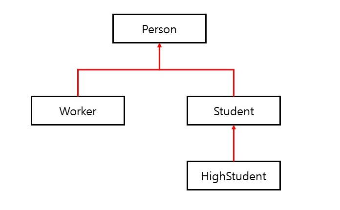

# 제네릭

## 제네릭을 사용하는 이유

제네릭 타입을 이용함으로써 잘못된 타입이 사용될 수 있는 문제를 컴파일 과정에서 제거할 수 있게 되었다. 제네릭은 클래스와 인터페이스, 그리고 메소드를 정의할 때 타입(type)을 파라미터(parameter)로 사용할 수 있도록 한다. 타입 파라미터는 코드 작성 시 구체적인 타입으로 대체되어 다양한 코드를 생성하도록 해준다. 제네릭을 사용하는 코드는 비제네릭 코드에 비해 다음과 같은 이점을 가지고 있다.

#### 컴파일 시 강한 타입 체크를 할 수 있다.

자바 컴파일러는 코드에서 잘못된 타입 때문에 발생하는 문제점을 제거하기 위해 제네릭 코드에 대해 강한 타입 체크를 한다. 실행 시 타입 에러가 나는 것보다는 컴파일 시에 미리 타입을 강하게 체크해서 에러를 사전에 방지하는 것이 좋다.

#### 타입 변환(casting)을 제거한다.

비제네릭 코드는 불필요한 타입 변환을 하기 때문에 프로그램 성능에 악영향을 미친다.

다음 코드를 보면 List에 문자열 요소를 저장했지만, 요소를 찾아올 때는 반드시 String으로 타입 변환을 해야한다.

```java
List list = new ArrayList();
list.add("hello");
String str = (String) list.get(0); // 타입 변환을 해야 함
```

다음과 같이 제네릭 코드로 수정하면 List에 저장되는 요소를 String 타입으로 제한하기 때문에 요소를 찾아올 때 타입 변환을 할 필요가 없어 프로그램 성능이 향상된다.

```java
List<String> list = new ArrayList<String>();
list.add("hello");
String str = list.get(0); // 타입 변환을 하지 않는다.
```

## 제네릭 타입(class\<T>, interface\<T>)

제네릭 타입은 타입을 파라미터로 가지는 클래스와 인터페이스를 말한다. 제네릭 타입은 클래스 또는 인터페이스 이름 뒤에 "<>" 부호가 붙고, 사이에 타입 파라미터가 위치한다. 아래 코드에서 타입 파라미터의 이름은 T이다.

```java
public class 클래스명<T> { ... }
public interface 인터페이스명<T> { ... }
```

타입 파라미터는 변수명과 동일한 규칙에 따라 작성할 수 있지만, 일반적으로 대문자 알파벳 한 글자로 표현한다. 제네릭 타입을 실제 코드에서 사용하려면 타입 파라미터에 구체적인 타입을 지정해야 한다.

다음과 같이 모든 종류의 객체를 저장하면서 타입 변환이 발생하지 않도록 하는 방법이 있다.

```java
public class Box<T> {
	private T t;
    public T get() { return t; }
    public void set(T t) { this.t = t; }
}
```

타입 파라미터를 T를 사용해서 Object 타입을 모두 T로 대체했다. T는 Box 클래스로 객체를 생성할 때 구체적인 타입으로 변경된다.

```java
Box<String> box = new Box<String>();
```

타입 파라미터 T는 String 타입으로 변경되어 Box 클래스의 내부는 다음과 같이 자동으로 재구성된다.

```java
public class Box<String> {
    private String t;
    public String get() { return t; }
    public void set(String t) { this.t = t; }
}
```

필드 타입이 String으로 변경되었고, set() 메소드도 String 타입만 매개값으로 받을 수 있게 변경되었다. 그리고 get() 메소드 역시 String 타입으로 리턴하도록 변경되었다. 그래서 저장할 때와 읽어올 때 전혀 타입 변환이 발생하지 않는다.

Integer로 생성해보면

```java
Box<Integer> box = new Box<Integer>();
```

다음과 같이 타입 파라미터 T는 Integer 타입으로 변경되어 Box 클래스는 내부적으로 다음과 같이 자동으로 재구성된다.

```java
public class Box<Integer> {
    private Integer t;
    public Integer get() { return t; }
    public void set(Integer t) { this.t = t; }
}
```

이와 같이 제네릭은 클래스를 설계할 때 구체적인 타입을 명시하지 않고, 타입 파라미터로 대체했다가 실제 클래스가 사용될 때 구체적인 타입을 지정함으로써 타입 변환을 최소화시킨다.

## 멀티 타입 파라미터(class\<K, V, ...>, interface\<K, V, ...>)

제네릭 타입은 두 개 이상의 멀티 타입 파라미터를 사용할 수 있는데, 이 경우 각 타입 파라미터를 콤마로 구분한다. Product<T, M> 제네릭 타입을 정의하고 ProductExample 클래스에서 Product<Tv, String> 객체와 Product<Car, String> 객체를 생성한다. 

##### Product 클래스

```java
public class Product<T, M> {
    private T kind;
    private M model;
    
    public T getKind() { return this.kind; }
    public M getModel() { return this.model; }
    
    public void setKind(T kind) { this.kind = kind; }
    public void setModel(M model) { this.model = model; }
}
```

##### ProductExample 클래스

```java
public class ProductExample {
    public static void main(String[] args) {
        Product<Tv, String> product1 = new Product<>();
        product1.setKind(new Tv());
        product1.setModel("스마트Tv");
        Tv tv = product1.getKind();
        String tvModel = product1.getModel();
        
        Product<Car, String> product2 = new Product<>();
        product2.setKind(new Car());
        product2.setModel("디젤");
        Car car = product2.getKind();
        String carModel = product2.getModel();
    }
}
```

## 제네릭 메소드(\<T, R> R method(T t))

제네릭 메소드는 매개 타입과 리턴 타입으로 타입 파라미터를 갖는 메소드를 말한다. 제네릭 메소드를 선언하는 방법은 리턴 타입 앞에 <> 기호를 추가하고 타입 파라미터를 기술한 다음, 리턴 타입과 매개 타입으로 타입파라미터를 사용하면 된다.

```java
public <타입파라미터, ...> 리턴타입 메소드명(매개변수, ...) { ... }
```

다음 boxing() 제네릭 메소드는 <> 기호 안에 타입 파라미터 T를 기술한 뒤, 매개 변수 타입으로 T를 사용했고, 리턴 타입으로 제네릭 타입 Box\<T>를 사용했다.

```java
public <T> Box<T> boxing(T t) { ... }
```

제네릭 메소드는 두 가지 방식으로 호출할 수 있다. 코드에서 타입 파라미터의 구체적인 타입을 명시적으로 지정해도 되고, 컴파일러가 매개값의 타입을 보고 구체적인 타입을 추정하도록 할 수 있다.

```
리턴타입 변수 = <구체적타입> 메소드명(매개값); // 명시적으로 구체적 타입을 지정
리턴타입 변수 = 메소드명(매개값) // 매개값을 보고 구체적 타입을 추정
```

예)

```java
Box<Integer> box = <Integer>boxing(100); // 타입 파라미터를 명시적으로 Integer로 지정
Box<Integer> box = boxing(100); // 타입 파라미터를 Integer로 추정
```

## 제한된 타입 파라미터(\<T extends 최상위타입>)

타입 파라미터에 지정되는 구체적인 타입을 제한할 필요가 종종 있다. 예를 들어 숫자를 연산하는 제네릭 메소드는 매개값으로 Number 타입 또는 하위 클래스 타입(Byte, Short, Integer, Long, Double)의 인스턴스만 가져야 한다. 이것이 제한된 타입 파라미터(bounded type parameter)가 필요한 이유이다.

제한된 타입 파라미터를 선언하려면 타입 파라미터 뒤에 extends 키워드를 붙이고 상위 타입을 명시하면 된다. 상위 타입은 클래스뿐만 아니라 인터페이스도 가능하다. 인터페이스라고 해서 implements를 사용하지 않는다.

```java
public <T extends 상위타입> 리턴타입 메소드(매개변수, ...) { ... }
```

타입 파라미터에 지정되는 구체적인 타입은 상위 타입이거나 상위 타입의 하위 또는 구현 클래스만 가능하다. 주의할 점은 메소드의 중괄호 {} 안에서 타입 파라미터 변수로 사용 가능한 것은 상위 타입의 멤버(필드, 메소드)로 제한된다. 하위 타입에만 있는 필드와 메소드는 사용할 수 없다. 하위 타입에만 있는 필드와 메소드는 사용할 수 없다.

다음은 숫자 타입만 구체적인 타입으로 갖는 제네릭 메소드 compare() 이다. 두 개의 숫자 타입을 매개값으로 받아 차이를 리턴한다.

```java
public <T extends Number> int compare(T t1, T t2) {
    double v1 = t1.doubleValue(); // Number의 doubleValue() 메소드 사용
    double v2 = t2.doubleValue(); // Number의 doubleValue() 메소드 사용
    return Double.compare(v1, v2);
}
```

doubleValue() 메소드는 Number 클래스에 정의되어 있는 메소드로 숫자를 double 타입으로 변환한다. Double.compare() 메소드는 첫 번째 매개값이 작으면 -1을, 같으면 0을, 크면 1을 리턴한다.

## 와일드카드 타입(<?>, <? extends ...>, <? super ...>)

코드에서 ?를 일반적으로 와일드카드(wildcard)라고 부른다. 제네릭 타입을 매개값이나 리턴 타입으로 사용할 때 구체적인 타입 대신에 와일드카드를 다음과 같이 세 가지 형태로 사용할 수 있다.

- ##### 제네릭타입<?> : Unbounded Wildcards(제한 없음)

  타입 파라미터를 대치하는 구체적인 타입으로 모든 클래스나 인터페이스 타입이 올 수 있다.

- ##### 제네릭타입<? extends 상위타입> : Upper Bounded Wildcards(상위 클래스 제한)

  타입 파라미터를 대치하는 구체적인 타입으로 상위 타입이나 하위 타입만 올 수 있다.

- ##### 제네릭타입<? super 하위타입> : Lower Bounded Wildcards(하위 클래스 제한)

  타입 파라미터를 대치하는 구체적인 타입으로 하위 타입이나 상위 타입이 올 수 있다.

예시를 보자.

```java
public class Course<T> {
    private String name;
    private T[] student;
    
    public Course<String name, int capacity) {
        this.name = name;
        students = (T[]) (new Object[capacity]); // 타입 파라미터로 배열을 생성하려면 new T[n] 형태로 배열을 생성할 수 없고 (T[]) (new Object[n]으로 생성해야 한다.
    }
}
```

수업 과정에서 수강생이 될 수 있는 타입은 다음 4가지 클래스라고 가정하자. Person의 하위 클래스로 Worker와 Student가 있고, Student의 하위 클래스로 HighStudent가 있다.



- ##### Course<?>

  수강생은 모든 타입 (Person, Worker, Student, HighStudent)이 될 수 있다.

- ##### Course<? extends Student>

  수강생은 Student와 HighStudent만 될 수 있다.

- ##### Course<? super Worker>

  수강생은 Worker와 Person만 될 수 있다.

## 제네릭 타입의 상속과 구현

제네릭 타입도 다른 타입과 마찬가지로 부모 클래스가 될 수 있다. 다음은 Product<T, M> 제네릭 타입을 상속해서 ChildProduct<T, M> 타입을 정의한다.

```java
public class ChildProduct<T, M> extends Product<T, M> { ... }
```

자식 제네릭 타입은 추가적으로 타입 파라미터를 가질 수 있다. 다음은 세 가지 타입 파라미터를 가진 자식 제네릭 타입을 선언한 것이다.

```java
public class ChildProduct<T, M, C> extends Product<T, M> { ... }
```

##### Product 클래스

```java
public class Product<T, M> {
    private T kind;
    private M model;
    
    public T getKind() { return this.kind; }
    public M getModel() { return this.model; }
    
    public void setKind(T kind) { this.kind = kind; }
    public void setModel(M model) { this.model = model; }
}

class Tv {}
```

##### ChildProduct 클래스

```java
public class ChildProduct<T, M, C> extends Product<T, M> {
    private C company;
    public C getCompany() { return this.company; }
    public void setCompany(C Company) { this.company = company; }
}
```

제네릭 인터페이스를 구현한 클래스도 제네릭 타입이 되는데, 다음과 같이 제네릭 인터페이스가 있다고 가정하자.

```java
public interface Storage<T> {
    public void add(T item, int index);
    public T get(int index);
}
```

제네릭 인터페이스인 Storage\<T> 타입을 구현한 StorageImpl 클래스도 제네릭 타입이어야 한다.

```java
public class StorageImpl<T> implements Storage<T> {
    private T[] array;
    
    public StorageImpl(int capacity) {
        this.array = (T[]) (new Object[capacity]);
    }
    
    @Override
    public void add(T item, int index) {
        array[index] = item;
    }
    
    @Override
    public T get(int index) {
        return array[index];
    }
}
```

다음은 ChildProduct<T, M, C>와 StorageImpl\<T> 클래스의 사용 방법의 예시이다.

##### ChildProductAndStorageExample 클래스

```java
public class ChildProductAndStorageExample {
    public static void main(String[] args) {
        ChildProduct<Tv, String, String> product = new ChildProduct<>();
        product.setKind(new Tv());
        product.setModel("Smart TV");
        product.setCompany("Samsung");
        
        Storage<Tv> storage = new StorageImpl<Tv>(100);
        storage.add(new Tv(), 0);
        Tv tv = storage.get(0);
    }
}
```